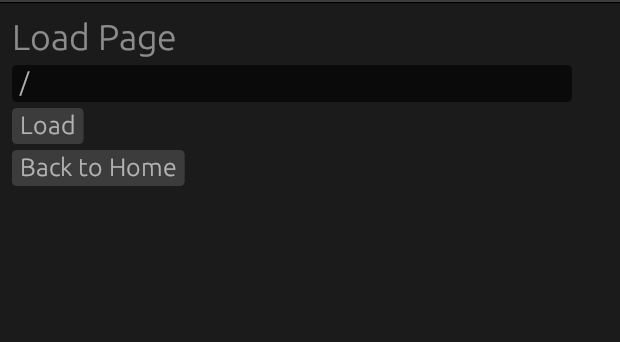
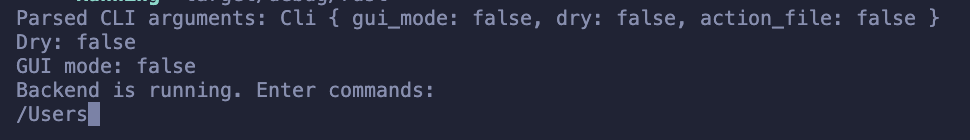
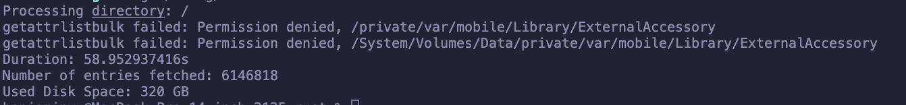

README describes
each feature
implemented
● Quantitative or qualitative results are clearly displayed with instructions demonstrating how to reproduce the results
● (For a command line tool) example invocations and expected output
● (For a data science package) Instructions for downloading a dataset as well as expected results on that dataset
● (For a game) example screenshots and guide to build and run
● (For project with non-cargo dependencies) a docker container with necessary dependencies
● (For non-trivially reproducible projects e.g. hardware) images or videos demonstrating projects in action

The implemeneted project is file management tool for MacOS (only MacOS). The product primarily seeks to de-abstract the APFS (Apple File System) in order for users to directly locate and manage files. Cleanups can either be manually or AI-powered.

Once cloned, there are three CLI flags to consider: `--gui-mode`, `--action-file`, and `--dry`.

`--gui-mode`: Including this flag launches the application with a gui. Excluding it launches the application with only the terminal interface. AI features are only available when using the gui interface.

`--action-file`: Including this flag creates a action file where all committed actions are stored.

`--dry`: Including this flag launches the application in dry mode–committed actions are not actually passed onto the computer's file system. All changes are only virtual.

It may also be importand to consider whether or not to run this application with `sudo`. This is highly dependent on your own filesystem and permissions setup.

The first step should always be specifying the root on which the application should run (to scope the entire filesystem, input '/'). On the gui, do this by navigating to the Load Page and clicking 'load'. Using the cli, simply enter the desired location. 

On gui:



On cli:



This file load should be relatively quick depending on the size of your specified location and computer. On my hardware, I get the following results:




After loading the filesystem, you will have access to the following commands:
```
1. `..` - Moves up one level.
2. `<index>` - Moves down to the child at the specified index.
3. `go to <path>` - Navigates to the specified path.
4. `commit` - Commits the current state.
5. `undo <index>` - Reverts to a specific commit index.
6. `status` - Displays the current status.
7. `display` - Displays content or structure at the current level.
8. `create file <name>` - Creates a file with the specified name.
9. `create folder <name>` - Creates a folder with the specified name.
10. `del <index>` - Deletes the item at the specified index.
11. `open <index>` - Opens the item at the specified index.
12. `move <source> > <destination>` - Moves an item from source into destination directory.
13. `help` - Displays this help message.
```

`<index>` refers to an integer while all others should be Strings.